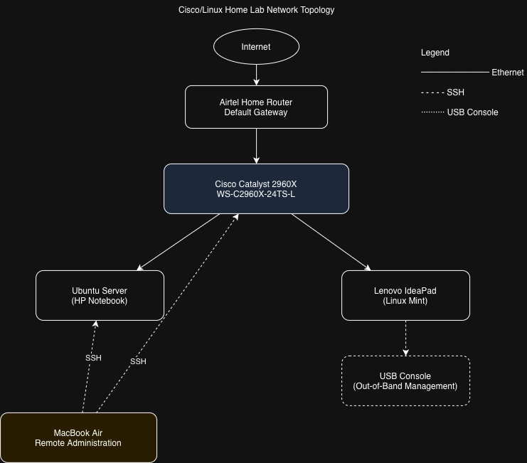
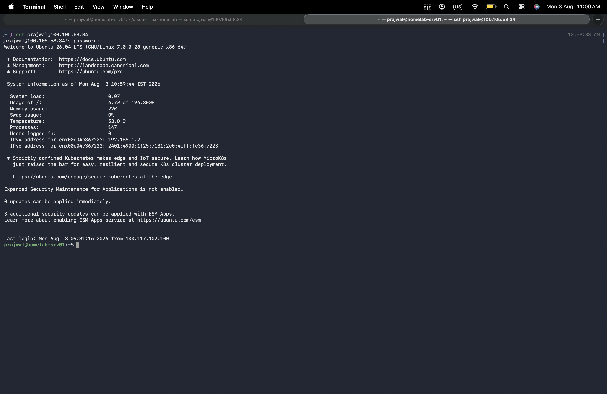
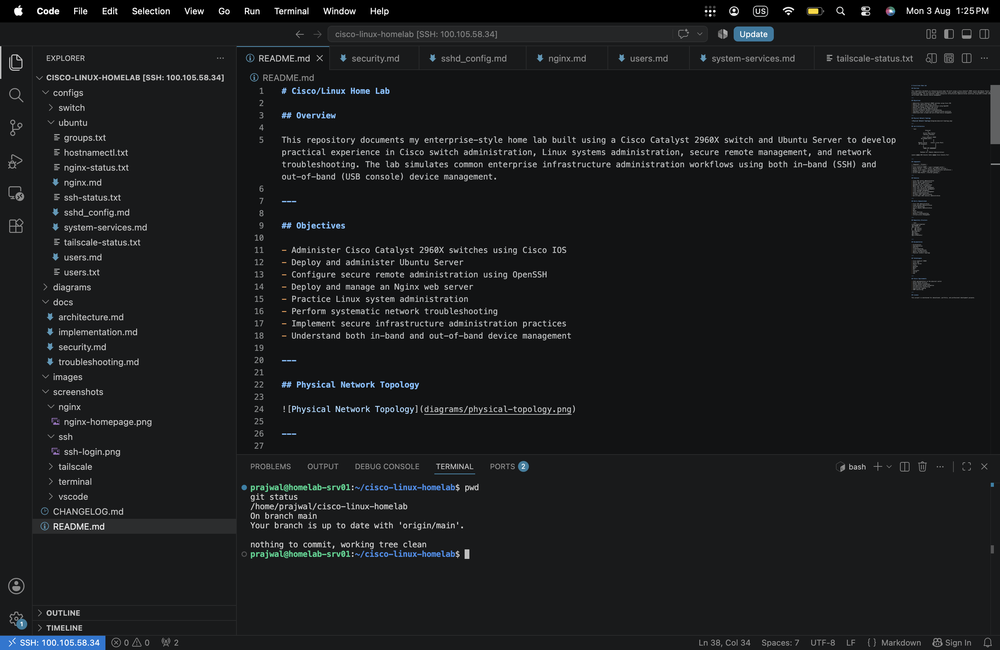
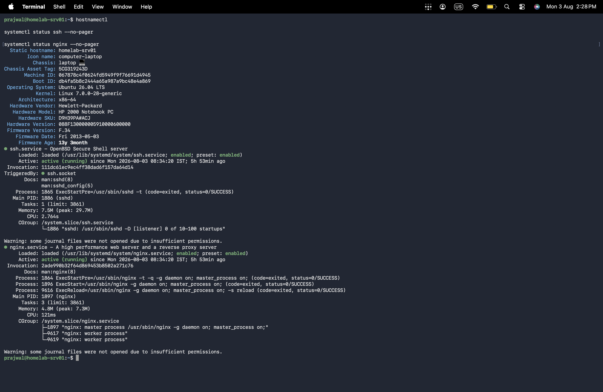
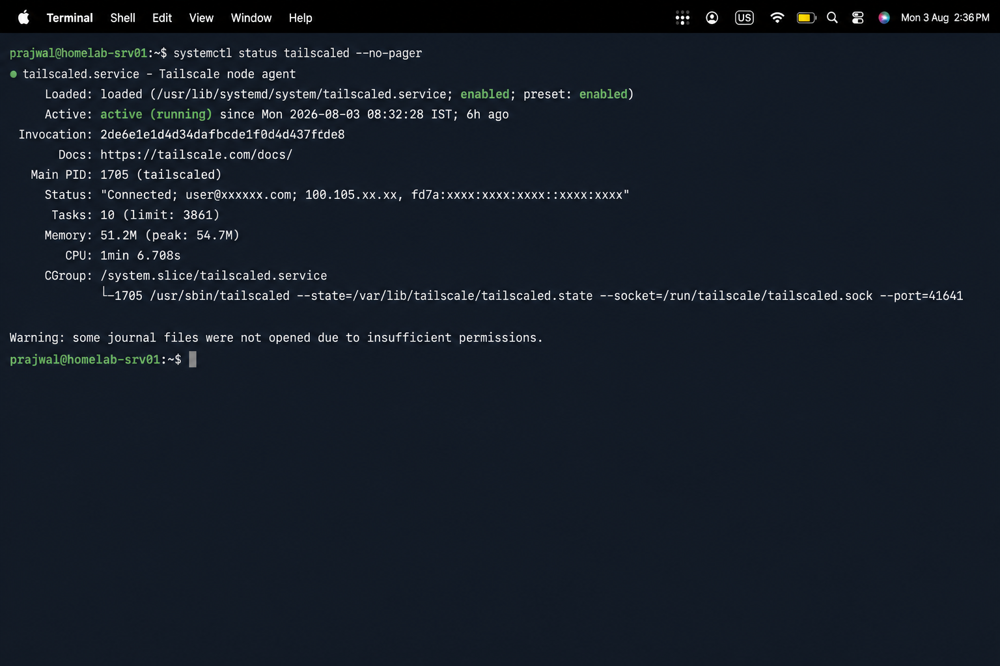
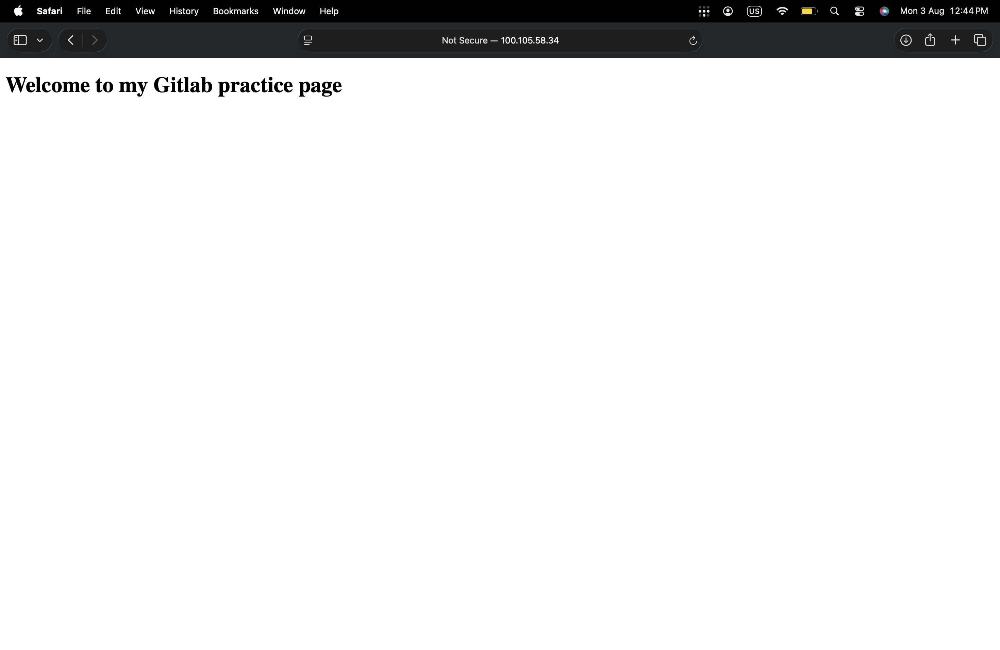

# Enterprise Cisco & Linux Infrastructure Homelab


---

## Overview

This repository documents my enterprise-style **Cisco/Linux Home Lab** built to develop practical experience in Linux system administration, Cisco networking, secure remote management, infrastructure documentation, and network troubleshooting.

The lab simulates common enterprise infrastructure administration workflows using both **in-band (SSH)** and **out-of-band (USB Console)** management.

---


## Quick Facts

| Item | Value |
|------|-------|
| Operating System | Ubuntu 26.04 LTS |
| Switch | Cisco Catalyst 2960X (WS-C2960X-24TS-L) |
| Remote Access | OpenSSH, Tailscale |
| Web Server | Nginx |
| Version Control | Git & GitHub |
| Documentation | Markdown |
| Development | VS Code Remote SSH |

---

# Objectives

- Build enterprise Linux administration skills
- Practice Cisco IOS administration
- Configure secure SSH remote management
- Deploy an Nginx web server
- Document infrastructure professionally
- Troubleshoot enterprise networking issues
- Learn Git and GitHub workflow
- Build a professional infrastructure portfolio

---

# Physical Network Topology



---

# Lab Architecture

```text
                    Internet
                        │
                 Airtel Home Router
                 (Default Gateway)
                        │
                Cisco Catalyst 2960X
              WS-C2960X-24TS-L
                 │              │
                 │              │
          Ubuntu Server     Lenovo (Linux Mint)
          (HP Notebook)            │
                 ▲                 │
                 │                 │
                 └──── SSH ────────┘
                       ▲
                       │
             MacBook Air (Remote Administration)

Lenovo ───── USB Console Cable ───── Cisco Console Port
```

---

# Hardware

| Device | Purpose |
|---------|---------|
| Cisco Catalyst 2960X | Layer-2 Managed Switch |
| HP 2000 Notebook PC | Ubuntu Server |
| Lenovo Laptop | Linux Mint Administration Workstation |
| MacBook Air | Remote Administration |
| Airtel Home Router | Internet Gateway |

---

# Software Stack

- Ubuntu 26.04 LTS
- Cisco IOS
- OpenSSH
- Nginx
- Tailscale
- Git
- GitHub
- VS Code Remote SSH

---

# Features

- Cisco IOS Administration
- Ubuntu Server Administration
- Secure SSH Remote Access
- Tailscale Remote Connectivity
- Nginx Web Hosting
- Linux User & Group Management
- Linux Service Management
- Git Version Control
- Infrastructure Documentation
- Network Troubleshooting
- In-band Device Management
- Out-of-band Console Management

---

# Completed Configuration

- ✅ SSH remote administration
- ✅ Cisco local user authentication
- ✅ Secure VTY configuration (SSH only)
- ✅ NTP synchronization with time.google.com
- ✅ Syslog forwarding to Ubuntu Server (rsyslog)
- ✅ PortFast configuration on edge ports
- ✅ BPDU Guard on access ports
- ✅ Switch management VLAN configuration
- ✅ GitHub-based configuration backup
- ✅ Python automation using Netmiko


---

# Network Automation

The lab includes Python automation using Netmiko to:

- Connect to the Cisco switch over SSH
- Execute multiple operational commands
- Save outputs automatically
- Maintain switch documentation
- Version control configuration snapshots using Git

Commands collected include:

- show version
- show inventory
- show ip interface brief
- show interfaces status
- show interfaces description
- show vlan brief
- show mac address-table
- show spanning-tree summary
- show logging
- show ntp status
- show ip ssh
- show running-config
- show startup-config


---


# Security Hardening

Implemented security measures include:

- SSH-only remote administration
- Local authenticated user accounts
- Password-encrypted user database
- PortFast configured on edge interfaces
- BPDU Guard enabled on access ports
- NTP synchronization with `time.google.com`
- Centralized syslog logging to Ubuntu Server (`rsyslog`)
- Secure switch management using SSH (VTY configured for SSH only)

---


# Network Services

| Service | Status | Purpose |
|---------|--------|---------|
| OpenSSH | Running | Secure Remote Administration |
| Nginx | Running | Web Hosting |
| Tailscale | Running | Secure Remote Networking |

---


# Skills Demonstrated

- Linux System Administration
- Cisco IOS Administration
- TCP/IP Networking
- Secure Remote Administration
- SSH
- Nginx
- Linux Services
- Git & GitHub
- Infrastructure Documentation
- Network Troubleshooting

---

# Cisco Technologies

The following Cisco technologies are implemented or explored in this home lab:

- Cisco IOS CLI
- VLANs
- SSH
- NTP
- Syslog
- PortFast
- BPDU Guard
- Management VLAN
- MAC Address Table
- Spanning Tree Protocol (STP)


---

# Repository Structure

```text
cisco-linux-homelab/
├── README.md
├── CHANGELOG.md
├── LICENSE
├── automation/
│   ├── backup_switch.py
│   ├── show_version.py
│   └── requirements.txt
├── configs/
│   ├── switch/
│   └── ubuntu/
├── diagrams/
├── docs/
├── images/
└── screenshots/
    ├── nginx/
    ├── ssh/
    ├── tailscale/
    ├── terminal/
    └── vscode/
```
---

# Documentation

The repository contains documentation for:

- Architecture
- Implementation
- Security
- Troubleshooting
- Ubuntu Configuration
- Cisco Configuration
- Network Topology

---

# Verification Screenshots

## SSH Login



---

## VS Code Remote SSH



---

## Ubuntu System Information



---

## Tailscale



---

## Nginx Homepage



---

# Technologies Used

- Cisco Catalyst 2960X
- Cisco IOS
- Ubuntu Server
- Linux
- OpenSSH
- Nginx
- Git
- GitHub
- Tailscale
- VS Code Remote SSH
- TCP/IP

---

# Future Improvements

- VLAN Configuration
- Inter-VLAN Routing
- Port Security
- Docker Containers
- Infrastructure Monitoring
- SNMP Monitoring
- Ansible Automation
- Prometheus & Grafana
- Kubernetes Home Lab

---

# Author

**Prajwal R**

Information Science & Engineering Student

### Areas of Interest

- Linux System Administration
- Computer Networking
- Infrastructure Engineering
- Network Automation
- Cloud Infrastructure

---

# License

This repository is maintained for educational, portfolio, and professional development purposes.